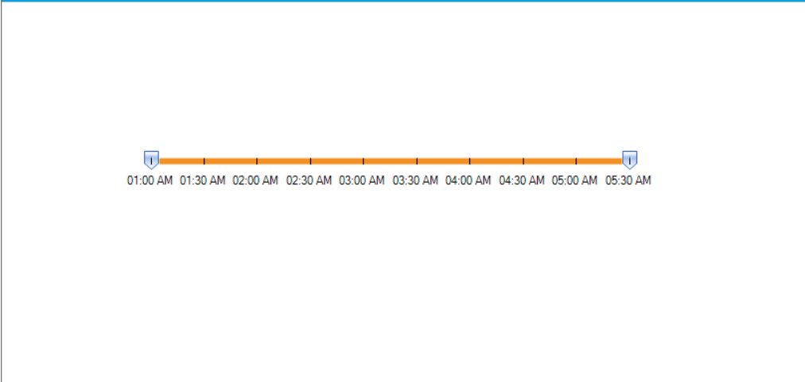

# How to Customize the Range Intervals in WinForms RangeSlider
The Syncfusion WinForms RangeSlider control provides options to customize the slider range to meet specific application requirements. By adjusting properties such as Minimum, Maximum, TickFrequency, and handling the DrawLabel event, you can create a slider that fits your desired range and display format.

## Why Customize the Range?
Customizing the range intervals allows you to:
- Define the minimum and maximum values for the slider.
- Control the tick frequency for precise value selection.
- Display custom labels (e.g., time intervals) for better user experience.

## Key Properties

- **Minimum**: Sets the lowest value of the slider.
- **Maximum**: Defines the highest value of the slider.
- **TickFrequency**: Determines the interval between ticks.
- **ShowLabels**: Enables label display on the slider.
- **StartPosition**: Specifies the initial position of the form.

## Example Code
```C#
public Form1()
{
    InitializeComponent();

    // Configure RangeSlider properties
    this.rangeSlider1.DrawLabel += RangeSlider1_DrawLabel;
    this.rangeSlider1.ShowLabels = true;
    this.rangeSlider1.Minimum = 1;
    this.rangeSlider1.Maximum = 10;
    this.rangeSlider1.TickFrequency = 1;

    // Center the form on the screen
    this.StartPosition = FormStartPosition.CenterScreen;
}

private void RangeSlider1_DrawLabel(object sender, DrawLabelEventArgs e)
{
    // Convert slider value to time intervals
    TimeSpan timeSpan = new TimeSpan(0, 30, 0);
    for (int i = 0; i < e.Value; i++)
    {
        timeSpan = timeSpan.Add(new TimeSpan(0, 30, 0));
    }

    DateTime time = DateTime.Today.Add(timeSpan);
    e.Text = time.ToString("hh:mm tt");
    e.Handled = true;
}
```

## Reference
For more details, refer to the official Syncfusion Knowledge Base: https://www.syncfusion.com/kb/11982/how-to-customize-the-range-intervals-in-winforms-rangeslider

## Output

